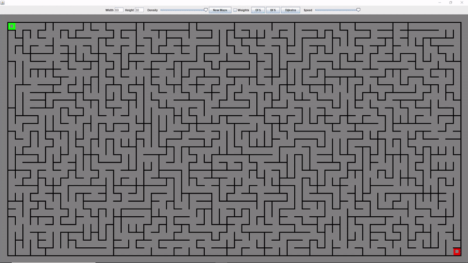

# MazeGraph Traversal

This project transforms randomly generated mazes into graphs.
These mazes are then solved by performing Depth-First searches, Breadth-First searches, and Dijkstra’s algorithm on the graphs.

Visually demonstrates how each search algorithm works. Can also be used to show that Dijkstra's algorithm
generates the lowest cost path from one node to another in a graph.

# Demo
This gif shows the maze being solved by a DFS, then a BFS, then by Dijkstra's algorithm.

Note: since this was a class project, code cannot be uploaded to Github or it would be an academic integrity violation.
